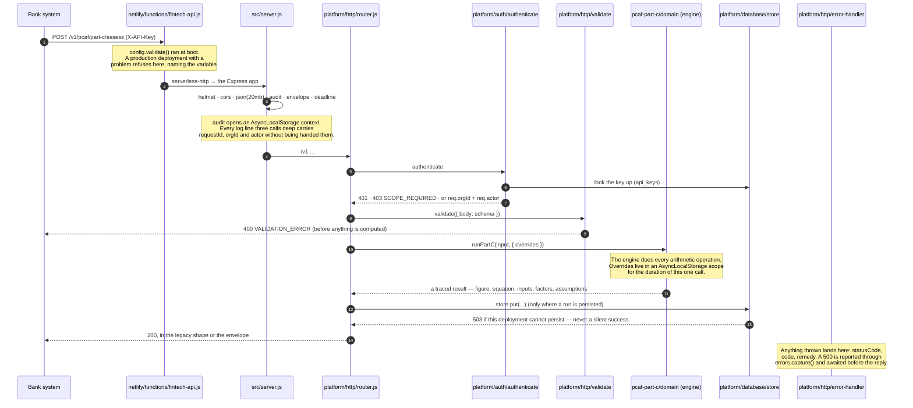
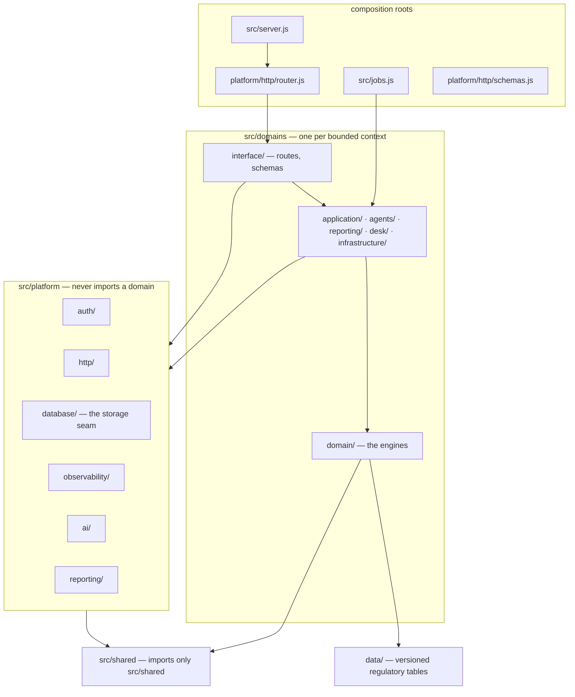

# Code tour

What happens when a request arrives, where everything lives, and what the
tables are. Read this before `CLAUDE.md`, which is the operating detail.

Two blocks below are generated from the code (`npm run docs:code-tour`) and a
test fails the build when they drift. Everything else is prose.

---

## 1. What this is

A Node/Express API that computes carbon figures for banks and insurers, and
renders them as documents those institutions file under a published standard.
It is deployed as a single Netlify Function wrapping the Express app, with a
static frontend beside it.

Three bodies of regulated work, and they are **not the same tonne of CO2e**:

| | What it attributes | Denominator | Where |
|---|---|---|---|
| **PCAF Part A** | financed emissions — a lender's share of a borrower's | outstanding amount | `src/domains/pcaf-part-a/` |
| **PCAF Part C** | insurance-associated emissions — a re/insurer's share | premium | `src/domains/pcaf-part-c/` |
| **GCF pipeline** | project mitigation against a counterfactual | — (not an attribution) | `src/domains/gcf/` |

Summing any two produces a figure no standard defines. Their engines never
import one another, and a test fails the build on an import between them.
See [ADR 0002](adr/0002-three-scopes-that-never-merge.md).

---

## 2. A request, end to end

`POST /v1/pcaf/part-c/assess` — the call that produces the regulatory figure.



**The order matters and is deliberate.**

- `authenticate` runs **before** `validate`, so an unauthenticated caller gets
  401 rather than a 400 that tells them what the body should look like.
- `audit` runs before both, so a refused request still has a request id.
- The deadline is read from the invocation by `platform/http/deadline.js` and
  handed to `platform/ai/deadline.js` as a number. The AI layer never sees a
  request.
- The error handler is last, and is the only place a status is decided from a
  thrown error.

### Where the response shape comes from

Two shapes, and every response says which in `X-Api-Envelope`:

- `application/json` — the legacy shape, unchanged for the whole of v1;
- `application/vnd.carboniq.v1+json` (or `X-Envelope: 1`, or `?envelope=1`) —
  the same body inside `{ data, meta, error }`.

`docs/openapi.json` is generated from the router and never written by hand.

---

## 3. The module map

Dependencies point inward. A `domain/` imports only its own domain,
`src/shared` and `data/`. The platform never imports a domain. Four
composition roots are the exception, because mounting the domains is their
job: `src/server.js`, `src/jobs.js`, `platform/http/router.js`,
`platform/http/schemas.js`. `tests/architecture.test.js` fails the build when
an edge points the wrong way — see [ADR 0007](adr/0007-dependencies-point-inward.md).



<!-- BEGIN MODULE-MAP — generated by npm run docs:code-tour -->
| Directory | Files | Lines |
|---|---:|---:|
| `src/` | 2 | 379 |
|       `src/domains/baseline/application/` | 1 | 270 |
|       `src/domains/baseline/domain/` | 4 | 671 |
|       `src/domains/baseline/infrastructure/` | 1 | 56 |
|         `src/domains/baseline/interface/routes/` | 1 | 160 |
|         `src/domains/baseline/interface/schemas/` | 1 | 70 |
|       `src/domains/capital/desk/` | 5 | 819 |
|       `src/domains/capital/domain/` | 8 | 1,406 |
|       `src/domains/capital/infrastructure/` | 3 | 768 |
|         `src/domains/capital/interface/routes/` | 2 | 718 |
|         `src/domains/capital/interface/schemas/` | 1 | 201 |
|       `src/domains/gcf/application/` | 2 | 837 |
|       `src/domains/gcf/domain/` | 7 | 2,217 |
|       `src/domains/gcf/infrastructure/` | 1 | 150 |
|         `src/domains/gcf/interface/routes/` | 1 | 23 |
|           `src/domains/gcf/interface/routes/gcf/` | 5 | 647 |
|         `src/domains/gcf/interface/schemas/` | 1 | 71 |
|       `src/domains/lending/agents/` | 9 | 3,343 |
|       `src/domains/lending/application/` | 6 | 1,450 |
|         `src/domains/lending/application/reports/` | 5 | 881 |
|       `src/domains/lending/domain/` | 7 | 811 |
|       `src/domains/lending/infrastructure/` | 1 | 94 |
|         `src/domains/lending/interface/routes/` | 13 | 1,785 |
|           `src/domains/lending/interface/routes/agent/` | 5 | 1,043 |
|         `src/domains/lending/interface/schemas/` | 11 | 667 |
|           `src/domains/lending/interface/schemas/agent/` | 4 | 593 |
|       `src/domains/pcaf-part-a/domain/` | 10 | 1,710 |
|         `src/domains/pcaf-part-a/domain/listed-equity/` | 9 | 1,388 |
|         `src/domains/pcaf-part-a/interface/routes/` | 1 | 110 |
|         `src/domains/pcaf-part-a/interface/schemas/` | 1 | 85 |
|       `src/domains/pcaf-part-c/agents/` | 6 | 924 |
|       `src/domains/pcaf-part-c/application/` | 12 | 3,175 |
|         `src/domains/pcaf-part-c/application/methodology/` | 3 | 387 |
|       `src/domains/pcaf-part-c/domain/` | 19 | 3,056 |
|         `src/domains/pcaf-part-c/interface/routes/` | 2 | 313 |
|           `src/domains/pcaf-part-c/interface/routes/partc-registry/` | 4 | 640 |
|           `src/domains/pcaf-part-c/interface/routes/pcaf-partc/` | 3 | 467 |
|         `src/domains/pcaf-part-c/interface/schemas/` | 4 | 471 |
|       `src/domains/pcaf-part-c/reporting/` | 5 | 639 |
|         `src/domains/pcaf-part-c/reporting/report-standard/` | 6 | 1,313 |
|         `src/domains/pcaf-part-c/reporting/theme/` | 4 | 707 |
|       `src/domains/taxonomy/application/` | 1 | 229 |
|       `src/domains/taxonomy/domain/` | 3 | 791 |
|         `src/domains/taxonomy/interface/routes/` | 3 | 381 |
|         `src/domains/taxonomy/interface/schemas/` | 2 | 130 |
|     `src/platform/ai/` | 5 | 913 |
|     `src/platform/auth/` | 11 | 1,671 |
|     `src/platform/bridge/` | 2 | 367 |
|     `src/platform/config/` | 3 | 372 |
|     `src/platform/database/` | 10 | 1,732 |
|       `src/platform/database/adapters/` | 6 | 436 |
|     `src/platform/http/` | 21 | 2,253 |
|     `src/platform/jobs/` | 3 | 413 |
|     `src/platform/observability/` | 6 | 813 |
|     `src/platform/reporting/` | 2 | 159 |
|   `src/shared/` | 9 | 1,583 |
|     `src/shared/models/` | 8 | 1,236 |
| **total** | **291** | **48,994** |

<!-- END MODULE-MAP -->

---

## 4. The data

One table per collection. The record is JSONB; the fields a query needs are
**generated columns**, so a column cannot disagree with the record and a
foreign key on it is a foreign key on the record.

`ON DELETE RESTRICT` everywhere: a project with a bill of quantities cannot be
deleted, and the refusal names what is attached.

Two unique indexes restate in the database what the services say in code — one
locked assessment per policy-year, one investment per adopted pipeline record —
because a check in code cannot stop two requests racing and an index can.

```mermaid
erDiagram
  partc_settings {
    string id PK
    string owner_org_id
    jsonb record
  }
  partc_clients {
    string id PK
    string owner_org_id
    jsonb record
  }
  partc_projects {
    string id PK
    string owner_org_id
    jsonb record
    string client_id "clientId"
  }
  partc_boq_revisions {
    string id PK
    string owner_org_id
    jsonb record
    string project_id "projectId"
  }
  partc_assessments {
    string id PK
    string owner_org_id
    jsonb record
    string project_id "projectId"
    string policy_id "policyId"
    string boq_revision_id "boqRevisionId"
    string reporting_year "reportingYear"
    string status "status"
  }
  capital_portfolios {
    string id PK
    string owner_org_id
    jsonb record
  }
  capital_investments {
    string id PK
    string owner_org_id
    jsonb record
    string portfolio_id "portfolioId"
    string status "status"
    string origin_system "origin.system"
    string origin_record_id "origin.recordId"
  }
  capital_payments {
    string id PK
    string owner_org_id
    jsonb record
    string portfolio_id "portfolioId"
    string investment_id "investmentId"
  }
  gcf_projects {
    string id PK
    string owner_org_id
    jsonb record
  }
  gcf_entity {
    string id PK
    string owner_org_id
    jsonb record
  }
  assurance_declarations {
    string id PK
    string owner_org_id
    jsonb record
  }
  api_keys {
    string id PK
    string owner_org_id
    jsonb record
    string owner_org_id "orgId"
    string active "active"
  }
  users {
    string id PK
    string owner_org_id
    jsonb record
    string email "email"
    string owner_org_id "orgId"
    string role "role"
    string active "active"
  }
  sessions {
    string id PK
    string owner_org_id
    jsonb record
    string user_id "userId"
    string owner_org_id "orgId"
    string expires_at "expiresAt"
  }
  partc_runs {
    string id PK
    string owner_org_id
    jsonb record
    string status "status"
  }
  partc_learnings {
    string id PK
    string owner_org_id
    jsonb record
  }
  partc_benchmarks {
    string id PK
    string owner_org_id
    jsonb record
    string region "region"
    string project_type "projectType"
  }
  fintech_projects {
    string id PK
    string owner_org_id
    jsonb record
    string region "region"
    string phase "phase"
  }
  fintech_monitoring {
    string id PK
    string owner_org_id
    jsonb record
    string project_id "projectId"
    string year "year"
  }
  agent_runs {
    string id PK
    string owner_org_id
    jsonb record
    string agent "agent"
    string status "status"
  }
  pipeline_runs {
    string id PK
    string owner_org_id
    jsonb record
    string status "status"
  }
  webhooks {
    string id PK
    string owner_org_id
    jsonb record
    string active "active"
  }
  baselines {
    string id PK
    string owner_org_id
    jsonb record
    string baseline_key "key"
    string metric "metric"
    string scope "scope"
    string country "country"
    string status "status"
  }
  partc_clients ||--o{ partc_projects : "restrict"
  partc_projects ||--o{ partc_boq_revisions : "restrict"
  partc_projects ||--o{ partc_assessments : "restrict"
  partc_boq_revisions ||--o{ partc_assessments : "restrict"
  capital_portfolios ||--o{ capital_investments : "restrict"
  capital_portfolios ||--o{ capital_payments : "restrict"
  capital_investments ||--o{ capital_payments : "restrict"
```

<!-- BEGIN ERD — generated by npm run docs:code-tour -->

<!-- END ERD -->

Migrations are plain SQL under `migrations/`, checksummed once applied; an
edited applied migration is **drift** and is refused. `audit_events` is
append-only by trigger and hash-chained (`npm run db:verify-audit`).

Full detail: [docs/DATA-LAYER.md](DATA-LAYER.md).

---

## 5. Finding your way

**A route.** `docs/API-SCOPES.md` lists every route and the scope it requires,
generated from the running router. `docs/openapi.json` has the shapes. The
handler is under `src/domains/<domain>/interface/routes/`.

**A figure.** Start at the domain's `domain/` directory — that is where every
arithmetic operation happens. Every engine function returns a *traced* value:
the figure, its equation, its inputs, its factors with tiers and sources, and
its assumptions.

**A factor.** `data/factors/*.json`, with `data/factors/MANIFEST.json` giving
each table's version, effective date, status and checksum.
`GET /v1/pcaf/part-c/factors` serves the same thing at runtime.

**A rule you have to obey.** The conformance matrices —
`src/domains/pcaf-part-c/domain/conformance.js` and
`src/domains/gcf/domain/conformance.js` — map clause → implementation →
proving test. `docs/CONFORMANCE-EVIDENCE.md` says which of those tests
actually executes the code it cites.

**Why something is the way it is.** [docs/adr/](adr/) — one decision per file,
each recording the failure that made it necessary.

**A word you do not recognise.** [docs/GLOSSARY.md](GLOSSARY.md). Read the
three 1–5 scales before you touch a data-quality score.

---

## 6. Running it

```bash
nvm use && npm install
npm test                 # in-memory store
npm run db:test-up       # PostgreSQL in Docker, migrated
npm run test:postgres    # the same suite on the real store
```

The whole stack, including the database and the built frontend:

```bash
docker compose -f docker/docker-compose.yml up
```

Deployment, environments and the release gate:
[docs/ENVIRONMENTS.md](ENVIRONMENTS.md) and
[docs/RELEASE-AND-ROLLBACK.md](RELEASE-AND-ROLLBACK.md).
